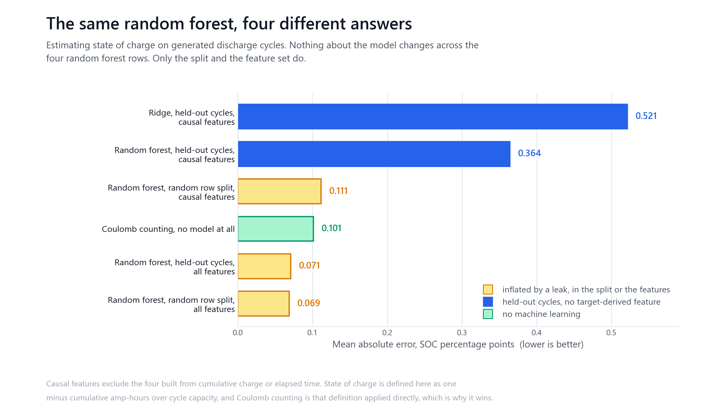
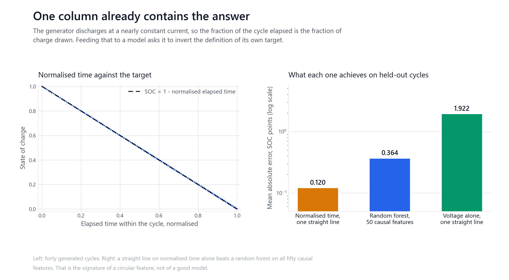
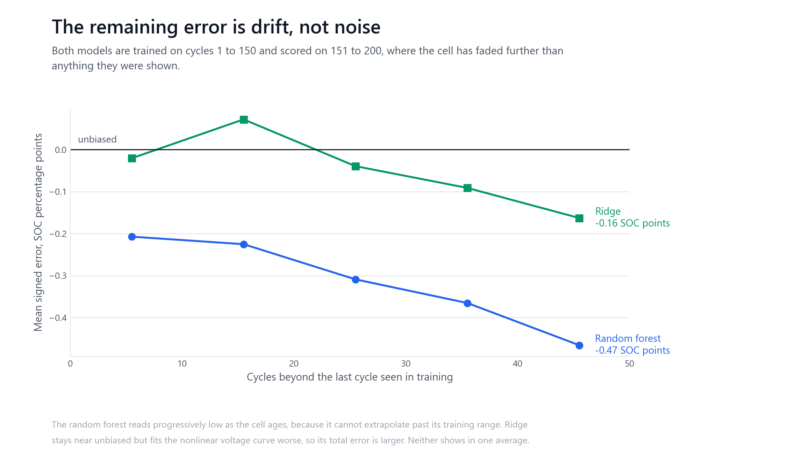
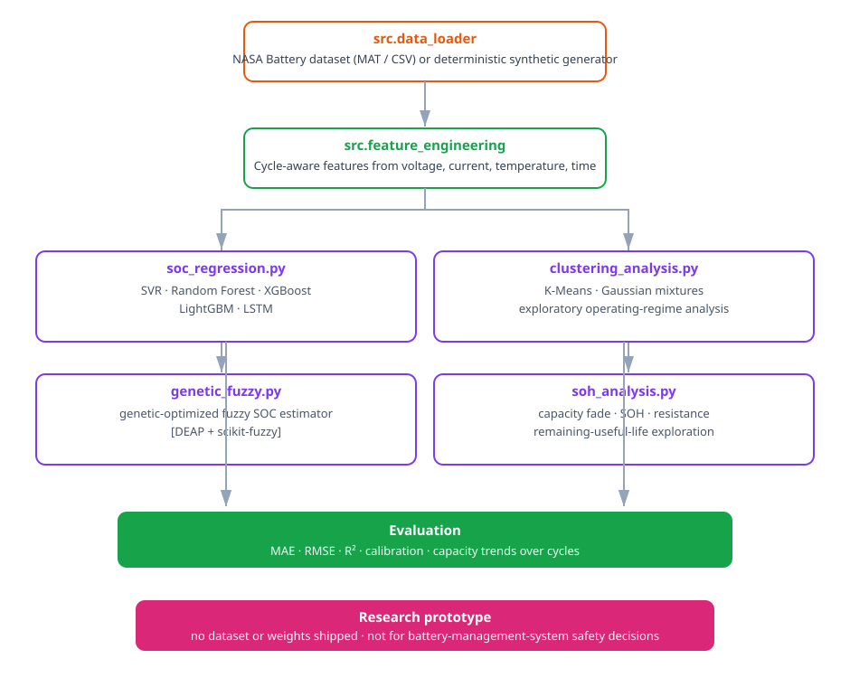

# Battery state of charge estimation

A lithium-ion cell has no fuel gauge. State of charge has to be inferred from
voltage, current, temperature and cycling history, and all of those drift as the
cell ages. This repository started as a comparison of machine-learning estimators
for that problem. What it can actually demonstrate is narrower and more useful:
how a state of charge benchmark produces a convincing number without the model
having learned anything.

> **Research prototype.** No battery dataset, trained weights or measured cell
> data is included. Every number below comes from data this repository generates.
> None of it is evidence about a physical battery, and none of it should inform a
> battery management system or a safety decision.



Four of those bars are the same random forest with the same hyperparameters on
the same generated cycles. The model does not change. The split and the feature
set do, and the reported error moves by a factor of five.

## What the data is

`src.data_loader.generate_synthetic_battery_data` produces 200 discharge cycles
of one cell, sampled 120 times per cycle, 24,000 rows in total. It computes state
of charge by Coulomb counting, one minus cumulative amp-hours over the cycle's
capacity, and then writes voltage and temperature as closed-form functions of
that value plus noise.

That construction bounds what any result here can mean. Recovering state of
charge from the generated voltage recovers a formula written a few lines earlier
in the same file. The comparisons between configurations are informative. The
absolute error values are not a measurement of battery estimation.

There is also exactly one cell, so nothing here holds out a cell, a temperature
or an operating condition. The only thing held out is later cycles of the cell
the model was trained on.

## The target contains itself



The feature engineering produces 54 columns. Four of them are functions of the
cumulative charge or elapsed time within a cycle, which is what state of charge
is defined from:

| Feature | What it is |
| --- | --- |
| `cycle_capacity_ah` | cumulative amp-hours, the numerator of the target's definition |
| `time_normalized` | position through the cycle, equal to one minus the target at constant current |
| `energy_wh` | cumulative power integral, the same quantity scaled by voltage |
| `temp_integral` | expanding mean, which carries elapsed time |

Because the generator discharges at a nearly constant 2 A, the fraction of the
cycle elapsed is the fraction of charge drawn. `time_normalized` correlates with
the target at 0.999986. A straight line on that one column reaches **0.120 SOC
percentage points** on held-out cycles, better than a random forest given all 50
remaining features, which reaches 0.364.

When one column and a straight line beat fifty columns and an ensemble, the
column is a restatement of the target rather than a good predictor. The four are
excluded from the feature set used for every honest number below.

## The split

Rows inside one discharge cycle are seconds apart and nearly identical. A random
row split puts a sample's own neighbours on the other side of the boundary. In
this data 93.4 percent of test rows have an immediate same-cycle neighbour in
training under a random split, against 0 percent under a cycle-wise split, which
`tests/test_leakage.py` measures directly.

The size of the resulting inflation is not fixed. What the leak conceals is
ageing drift, and drift needs cycles to accumulate, so the honest error grows
with the horizon while the random-row error does not depend on it at all:

| Held-out cycles | Cycle-wise split | Random row split | Understated by |
| --- | --- | --- | --- |
| 6 | 0.218 | 0.112 | 2.0x |
| 25 | 0.251 | 0.112 | 2.2x |
| 50 | 0.364 | 0.112 | 3.3x |

A benchmark that holds out only a few cycles understates the error by half. One
that also splits at random reports the same 0.112 whatever horizon it claims to
test.

Note also that ridge is almost unaffected by the random split, 0.5211 against
0.5212. Only a model flexible enough to memorise its neighbours can exploit the
leak, so a linear baseline will not reveal it.

## What is left after the leaks are removed



On held-out cycles with causal features only, the random forest reaches 0.364 SOC
percentage points. Most of that is not scatter. The mean signed error is -0.314,
so the model reads systematically low, and it reads further low the older the cell
gets: -0.207 over the first ten held-out cycles, -0.466 over the last ten.

The cause is that all 6,000 test rows sit beyond the training range of the cycle
index. Mean cycle capacity falls from 1.849 Ah in training to 1.649 Ah in test.
A tree cannot extrapolate past the range it was fitted on, so it keeps predicting
the ageing state it last saw. Adding the cycle number as a feature changes the
error by 0.0007 SOC points, which is consistent with that explanation rather than
with the model simply lacking the information.

Ridge behaves the opposite way. Its bias stays near zero because a linear fit
extrapolates the trend, but it fits the nonlinear voltage curve worse, so its
total error is larger at 0.521. Neither failure is visible in a single
average-error number.

## Does the model earn its complexity

All numbers are mean absolute error in SOC percentage points on held-out cycles
151 to 200, causal features only, from `results/benchmark.json`.

| Method | MAE | Bias | Predictions outside [0, 1] |
| --- | --- | --- | --- |
| Coulomb counting, no model | 0.101 | +0.015 | 0.0% |
| Random forest, 50 features | 0.364 | -0.314 | 0.0% |
| Ridge, 50 features | 0.521 | -0.048 | 2.0% |
| Voltage alone, straight line | 1.922 | -1.129 | 0.0% |
| Training mean | 25.215 | +0.003 | 0.0% |

On this data, no. The random forest is five times better than a single-sensor
linear fit and 69 times better than predicting the mean, so it is doing real
work. It is still 3.6 times worse than integrating the current, which needs no
training, no features and no fitting.

That result is partly circular and should be read as such. Coulomb counting wins
because the target was generated by Coulomb counting. On a physical cell the
integral accumulates sensor bias and needs periodic recalibration, which is the
actual problem learned estimators are meant to address. So this benchmark cannot
show that machine learning loses on a real battery. What it shows is that this
benchmark cannot be used to argue that it wins.

R squared is not reported as a headline because it does not discriminate here.
Every configuration in the table above scores above 0.993. The honest random
forest scores 0.99972 and the version with the circular features restored scores
0.99999, so the metric separates a circular model from a working one by three
parts in ten thousand. A target that sweeps the full range from 1 to 0 makes R
squared easy.

## Where the error sits

Error by state of charge band, random forest on causal features:

| SOC range | MAE, SOC points |
| --- | --- |
| 0.0 to 0.2 | 0.528 |
| 0.2 to 0.4 | 0.583 |
| 0.4 to 0.6 | 0.517 |
| 0.6 to 0.8 | 0.131 |
| 0.8 to 1.0 | 0.062 |

The estimate is roughly eight times worse on a nearly empty cell than on a nearly
full one. For a fuel gauge that ordering is backwards, since the low end is where
an error matters most. It follows from the drift above: the ageing offset acts on
the discharge tail, where the generated capacity fade has had the whole cycle to
accumulate.

## Reproducing

```bash
pip install -r requirements.txt

python -m src.benchmark                        # writes results/benchmark.json
python -m unittest discover -s tests           # 30 tests
python scripts/figures/generate_figures.py     # writes docs/figures/
python scripts/check_repository.py             # README against the recorded results
python scripts/check_reproducibility.py        # rerun, and check the findings survive
```

The benchmark takes about a minute on a laptop and needs no data, no GPU and no
network.

Every number in this README is read from `results/benchmark.json`.
`scripts/check_repository.py` fails if the two stop agreeing, which is what keeps
a stale README from outliving the results it describes.

`scripts/check_reproducibility.py` reruns the benchmark into a temporary file and
compares. It holds the sixteen findings the README argues from to exact agreement
and the numbers to five percent. That split is deliberate: requiring digit-for-digit
agreement across platforms fails on thread counts and summation order rather than
on anything being wrong, while a finding that flips means the README is saying
something false.

`requirements.txt` pins only what that path needs. `requirements-optional.txt`
adds the libraries the exploratory modules use.

## Limitations

One generated cell. No measured battery data, so nothing here has been checked
against a physical cell.

One seed and one architecture per model family. The comparisons are between
configurations of the same pipeline, not a tuned model search.

The split holds out later cycles of the same cell. It does not hold out a cell, a
temperature or a load profile, all of which a deployed estimator would face.

Coulomb counting is exact on this data by construction and would not be on a real
cell. Its position in the table is a property of the generator.

The four excluded features were identified by reading how the target is computed
and confirmed by measuring single-feature error. That procedure finds circular
features, but it is not a proof that the remaining 50 contain no subtler ones.

## What is exploratory

`src/soc_regression.py`, `src/clustering_analysis.py`, `src/genetic_fuzzy.py` and
`src/soh_analysis.py` predate the audit above and produce none of the numbers in
this README. Continuous integration compiles them and `scripts/smoke_test.py`
calls `evaluate_regression` on a two-element array, but nothing checks that their
model training paths are correct, and none of them has been audited for the
leakage described above. Their scores, if run, would carry the same circular
features and would need the same treatment before they meant anything.

`src/genetic_fuzzy.py` needs DEAP and scikit-fuzzy, which are not installed in
the environment these results were produced in, so it has not been run at all.

The two notebooks are kept as they were executed and have not been rerun against
the current benchmark.



## References

- Saha, B., and Goebel, K. (2007). *Battery Data Set*. NASA Prognostics Data Repository.
- Lipu, M. S. H., et al. (2018). A review of state of health and remaining useful life estimation methods for lithium-ion battery. *Journal of Cleaner Production*.

The NASA loading path in `src/data_loader.py` targets that dataset's format. No
external data is redistributed here, and none was used to produce these results.

## Licence

MIT. See [LICENSE](LICENSE).
